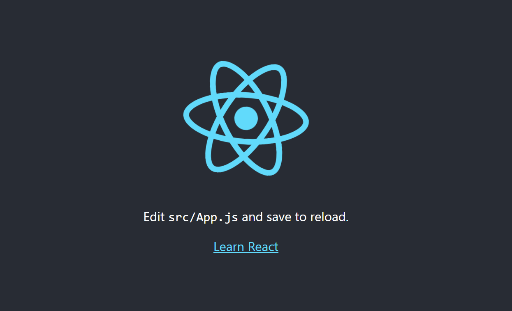
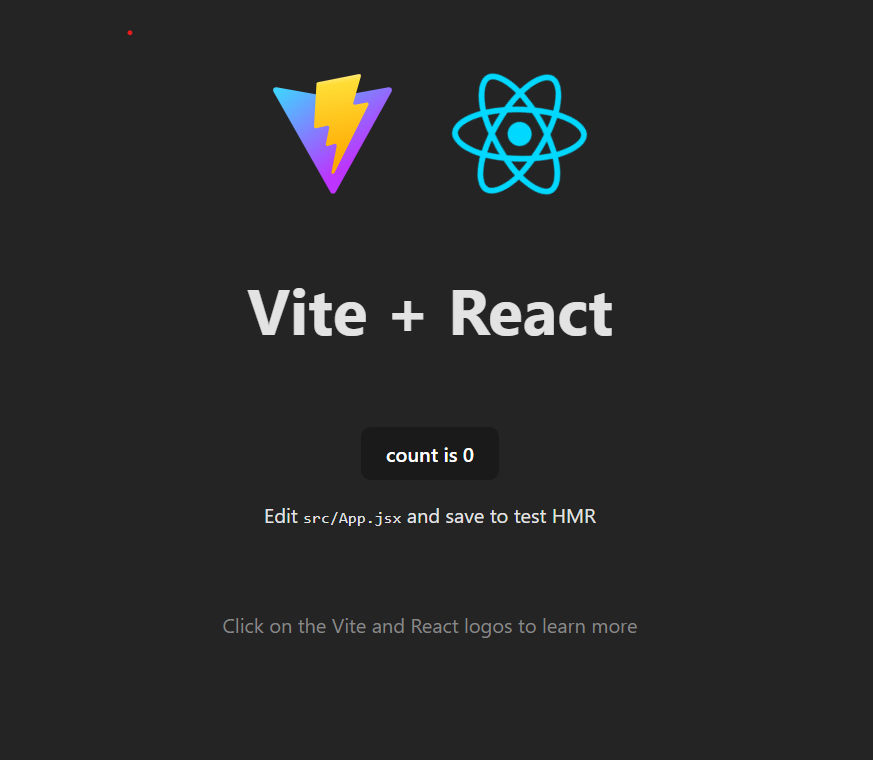

// Basic fundamentals of React - Js:-

when you want to work on web pages you choose "react - dom". 

when you want to work on building apps you use "react -native".

"cd" means change directory. (takes to the specific folder)

npm - "node package manager".

npx - "node package executor". (exchanger)

"package.json" is the entry point of the project, read the name of the project, version and other topics.

"bundle Vite" :- Vite is a tool that helps you quickly build and run web projects. When used with React, it makes starting and working on your project much faster compared to traditional tools. Vite speeds up development by instantly updating your changes without needing to reload the entire page, making the process smooth and efficient.

"gitignore" :- tells you the files which you have to push in git hub or not .

"src" is the source file in which you will edit the most .

The "manifest.json" file is a crucial part of a web application, especially for Progressive Web Apps (PWAs). It provides metadata about the application, such as its name, icons, theme colors, and how it should behave when installed on a user's device. it helps the website to open on a phone .

// Starting of the project :-

open a new terminal.

type npx create-react-app basic_react (name of the app). [it will take some time to download the files].

using cd basic_react(name of the project) - come inside the project.

type dir - make sure you see the package.json , after that you can start executing the project.

type cd basic_react 

to start type npm run start in the terminal.

react website will be opened on localhost : 3000.

go inside the folder by typing cd basic_react.

type npm run build - it will create a folder with files of static , html, manifest.json.

// now we will use the vite react to creat the app :-
(use this link for reference :- https://vitejs.dev/guide/)

type the code :- npm create vite@latest
check the name the project , choose React , select Javascript.

now compare both the folders through package.json file.

type npm i or npm install - it will download all the necessary node modules which you will require for creating the react app.

after the instalation use npm run dev .

a page of the website will open on local host : 5173.

now we have created the basic project using react and vite + react .

go to basic_react <= src <= delete all the files except index.js and app.js.

go to index.js <= remove the import of the files you have deleted, clear all the comments.

write a bsaic html header code and see if it runs .

follow the same steps as we did earlier for opening.

open new terminal

cd basic_react

npm run start  

// making changes in react app :-

create a file in src folder <= add a function with return type and export it .(name of the function should be starting with capital) 

import that function in "App.js" 

while importing the import Basic from "./basic" the second basic should be with small letters.

// useage of talwind CSS with vite react project :-
(use this link for reference :- https://tailwindcss.com/docs/guides/vite)

use the algorithm : npm install -D tailwindcss postcss autoprefixer

Running npm install -D tailwindcss postcss autoprefixer installs Tailwind CSS, PostCSS, and Autoprefixer as development dependencies. Here's a step-by-step explanation:

"npm install: The command used to install dependencies" :-

1) -D: The flag to install the packages as development dependencies.

2) tailwindcss: The Tailwind CSS framework.

3) postcss: A tool for transforming CSS with JavaScript plugins.

4) autoprefixer: A PostCSS plugin to parse CSS and add vendor prefixes to CSS rules.

"npx tailwindcss init -p" :-

Running npx tailwindcss init -p initializes a new Tailwind CSS configuration file with support for PostCSS. 
Here’s what the command does step-by-step:

1) npx: Executes a package from the npm registry.
2) tailwindcss: Specifies the Tailwind CSS package.
3) init: Initializes a new configuration file.
4) -p: Creates a postcss.config.js file in addition to the tailwind.config.js file.

After that copy the code given in the website , and follow it in sincronize order .

